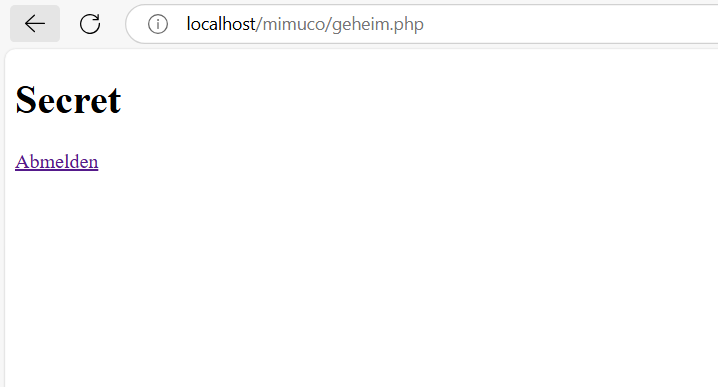

# websiteproject PHP login system

## features
- register      //first init
- login         //first init
- logout        //first init

## setup
- start xampp
- create new database
- create table in database
- import DB from phpMyAdmin
- create new user in database

## images
login form: 
register form: 
welcome page/logout form: 